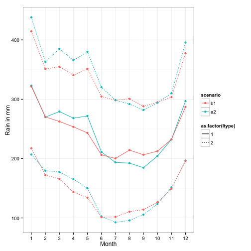
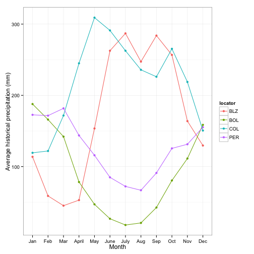
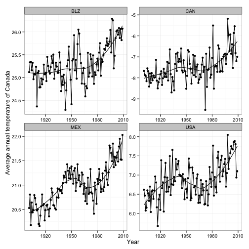
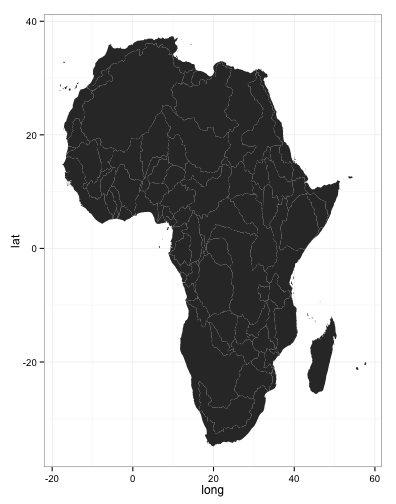
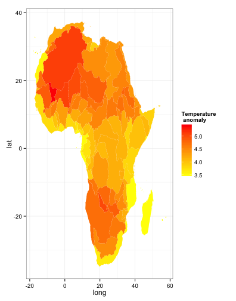

`rWBclimate` 
Introduction 
========================================================
rWBclimate is an R interface for the World Bank climate data used in the World Bank [climate knowledge portal](http://sdwebx.worldbank.org/climateportal/index.cfm).  

Installation
------
Right now the package is only installable from github with [devtools](http://cran.r-project.org/web/packages/devtools/index.html):

```R
install.packages("devtools")
require(devtools)

install_github("rWBclimate", "ropensci")
require(rWBclimate)
```
Package description
----

`rWBclimate` provides access to three different classes of climate data at two different spatial scales.  The three different classes of data are GCM model , ensemble and historical data.  Each data class will let you download two different four different types for two different variables.  The two variables are either precipitation expressed in millimeters or temperature as degrees celcius, and for each variable you can download your data in one of four types. The data is fully described below along with examples.

Data classes
---
*__Model data__*

Almost all model data in the Climate Data API are derived from 15 global circulation models (GCMs) used by the Intergovernmental Panel on Climate Change (IPCC) 4th Assessment Reports. The models simulate the response of the global climate system to increasing greenhouse gas concentrations. The data in the Climate Data API have been aggregated to both the country and basin levels, as explained below. Note these data are modeled estimates of temperature and precipitation changes in different time periods under different GCMs and scenarios. They include changes for future time periods and also as “backcasting” (model representations of the past) set for past time periods. The latter should not be confused with any instrumental or observed data. There is a specific dataset with historical measured climate data as well.

**Data types**

|Type|Description|
|----|----|
|Monthly average|The monthly average for all 12 months for a given time period|
|Annual average|a single average for a given time period|
|Monthly anomaly|Average monthly change (anomaly).  The control period is 1961-1999 for temperature and precipitation variables, and 1961-2000 for derived statistics.|
|Annual anomaly|Average annual change (anomaly). The control period is 1961-1999 for temperature and precipitation variables, and 1961-2000 for derived statistics.|

**Data time scales**

Climate model data is only available as averages for 20 year chunks.  The package will automatically convert any start and end data into valid API calls and will return all data between the given start and end date.  The following time periods are available


|Past|     |Future|    |
|----|-----|------|----|
|*start*|  *end*  |  *start*  |*end*|
|1920  | 1939|  2020 | 2039 |
|1940 |  1959|  2040 |2059|
|1960 |   1979|  2060 |2079 |
|1980  | 1999| 2080 | 2099 |

**Data spatial scales**
Data is available at two spatial scales.  The first is country level. You can download data for any country in the world using a valid [ISO 3 letter country code](http://userpage.chemie.fu-berlin.de/diverse/doc/ISO_3166.html). Alternatively you can download data at the basin network for a slightly higher resolution represented as a number 1-468.  This is based on level 2 boundaries from [waterbase.org](http://www.waterbase.org), or you can view a [full map of all the available basins.](http://data.worldbank.org/sites/default/files/climate_data_api_basins.pdf)


**_Downloading GCM Model Data_**

Model data is downloaded for two different scenarios, the [A2 and B1](http://en.wikipedia.org/wiki/Special_Report_on_Emissions_Scenarios). Generally A2 scenarios are where there is little difference between the future and now and B1 is a more ecologically friendly world with greater decrease in emissions. Both the A2 and the B1 will be downloaded for 15 different GCM models listed in the table below:


|Name in output|Model name|
|--------------|----------|
|bccr_bcm2_0 |[BCM 2.0](http://www-pcmdi.llnl.gov/ipcc/model_documentation/BCCR_BCM2.0.htm)|
|csiro_mk3_5|[CSIRO Mark 3.5](http://www.cawcr.gov.au/publications/technicalreports/CTR_021.pdf)|
|ingv_echam4|[ECHAM 4.6](http://www.bo.ingv.it/)|
|cccma_cgcm3_1|[CGCM 3.1 (T47)](http://www.ec.gc.ca/ccmac-cccma/default.asp?lang=En)|
|cnrm_cm3|[CNRM CM3](http://www.cnrm.meteo.fr/scenario2004/indexenglish.html)|
|gfdl_cm2_0|[GFDL CM2.0](http://data1.gfdl.noaa.gov/nomads/forms/deccen/CM2.X)|
|gfdl_cm2_1|[GFDL CM2.1](http://data1.gfdl.noaa.gov/nomads/forms/deccen/CM2.X)|
|ipsl_cm4|[IPSL-CM4](http://mc2.ipsl.jussieu.fr/simules.html)|
|microc3_2_medres|[MIROC 3.2 (medres)](https://esg.llnl.gov:8443/metadata/browseCatalog.do?uri=http://esgcet.llnl.gov/metadata/pcmdi/ipcc/thredds/miroc3_2_medres.sresb1/pcmdi.ipcc4.miroc3_2_medres.sresb1.thredds)|
|miub_echo_g|[ECHO-G](http://www-pcmdi.llnl.gov/projects/modeldoc/cmip/echo-g_tbls.html)|
|mpi_echam5|[ECHAM5/MPI-OM](http://www.mpimet.mpg.de/en/science/models/echam.html)|
|mri_cgcm2_3_2a|[MRI-CGCM2.3.2](http://www.mri-jma.go.jp/Welcome.html)|
|inmcm3_0|[INMCM3.0](http://www.ipcc-data.org/ar4/model-INM-CM3.html)|
|ukmo_hadcm3|[UKMO HadCM3](http://www.metoffice.gov.uk/research/modelling-systems/unified-model/climate-models/hadcm3)|
|ukmo_hadgem1|[UKMO HadGEM1](http://www.metoffice.gov.uk/research/modelling-systems/unified-model/climate-models/hadgem1)|

The model data can be downloaded with two main functions:
```R
get_model_temp()  ## Get model temperature data
get_model_precip() ## Get model precipitation data
```
*Example 1: Plotting monthly data from different GCM's* 
Say you want to compare temperature from two different models in the USA to see how they vary.  You can download data for the USA and then subset it to the specific models you're interested in and then plot them.


```r
usa.dat <- get_model_temp("USA", "mavg", 2080, 2100)
usa.dat.bcc <- usa.dat[usa.dat$gcm == "bccr_bcm2_0", ]
usa.dat.had <- usa.dat[usa.dat$gcm == "ukmo_hadcm3", ]
## Add a unique ID to each for easier plotting
usa.dat.bcc$ID <- paste(usa.dat.bcc$scenario, usa.dat.bcc$gcm, sep = "-")
usa.dat.had$ID <- paste(usa.dat.had$scenario, usa.dat.had$gcm, sep = "-")
plot.df <- rbind(usa.dat.bcc, usa.dat.had)
ggplot(plot.df, aes(x = as.factor(month), y = data, group = ID, colour = gcm, 
    linetype = scenario)) + geom_point() + geom_path() + ylab("Average temperature in degrees C \n between 2080 and 2100") + 
    xlab("Month") + theme_bw()
```

 


Subsetting all the data can be a bit tedious.  You could also compare all the models but just for one scenario, the A2.


```r
ggplot(usa.dat[usa.dat$scenario == "a2", ], aes(x = month, y = data, group = gcm, 
    colour = gcm)) + geom_point() + geom_path() + ylab("Average temperature in degrees C \n between 2080 and 2100") + 
    xlab("Month") + theme_bw()
```

 


*Example 2: Plotting annual data for different countries*

Data can be extracted from countries or basins submitted as vectors. Here we will plot the expected temperature anomaly for each 20 year period over a baseline control period of 1961-2000.  These countries chosen span the north to south pole.  It's clear from the plot that the northern most countries (US and Canada) have the biggest anomaly, and Belize, the most equatorial country, has the smallest anomaly.

```r
country.list <- c("CAN", "USA", "MEX", "BLZ", "COL", "PER", "BOL", "ARG")
country.dat <- get_model_temp(country.list, "annualanom", 2010, 2100)
# Subset data
country.dat.bcc <- country.dat[country.dat$gcm == "bccr_bcm2_0", ]
## Exclude A2 scenario
country.dat.bcc <- subset(country.dat.bcc, country.dat.bcc$scenario != "a2")
ggplot(country.dat.bcc, aes(x = fromYear, y = data, group = locator, colour = locator)) + 
    geom_point() + geom_path() + ylab("Temperature anomaly over baseline") + 
    theme_bw()
```

 


**_Downloading Ensemble Model Data_**

Getting raw model data is really useful for comparing scenarios or different GCM's.  However many users might be more interested in aggregated measurements. If so you can download ensemble climate data.  This will give access to all 15 GCM's combined and queries will return the 10th, 50th and 90th quantiles for the ensemble of all GCM's.  All queries are constructed the same as raw model data above with the same data types, spatial scales and time scales.

*Example 1: Comparing model quantiles*

Let's look at monthly precipitation predictions for Indonesia for the period of 2080-2100.  We'll create a plot of the precipitation expected in the future for the two different scenarios and plot them with different colours and dashed lines to indicate quantiles.


```r
idn.dat <- get_ensemble_precip("IDN", "mavg", 2080, 2100)
# Set line types
ltype <- rep(1, dim(idn.dat)[1])
ltype[idn.dat$percentile != 50] <- 2
idn.dat$ltype <- ltype
# Create uniqueIDs
idn.dat$uid <- paste(idn.dat$scenario, idn.dat$percentile, sep = "-")
ggplot(idn.dat, aes(x = as.factor(month), y = data, group = uid, colour = scenario, 
    linetype = as.factor(ltype))) + geom_point() + geom_path() + xlab("Month") + 
    ylab("Rain in mm") + theme_bw()
```

 


*Example 2: Ensemble statistics*

You can also download 13 different ensemble statistics about basins or countries aside from the raw data as above.  These derived statistics are often given relative to a control period, 1961-2000.  The time periods however are only for 2046-2065, or 2081-2100, not the standard 20 year intervals available for raw model data.  Below is a full table of available statistics.

|Parameter name|Description|Units|
|---------------|-------|-------|
|*tmin_means*|Average daily minimum temperature|degrees Celsius|
|*tmax_means*|Average daily maximum temperature|degrees Celsius|
|*tmax_days90th*|Number of days with maximum temperature above the control period’s 90th percentile (hot days)|days|
|*tmin_days90th*|Number of days with minimum  temperature above the control period’s 90th percentile (warm nights)|days|
|*tmax_days10th*|Number of days with maximum temperature below the control period’s 10th percentile (cool days)|days|
|*tmin_days10th*|Number of days with minimum  temperature below the control period’s 10th percentile (cold nights)|days|
|*tmin_days0*|Number of days with minimum  temperature below 0 degrees Celsius|days|
|*ppt_days*|Number of days with precipitation greater than 0.2 mm|days|
|*ppt_days2*|Number of days with precipitation greater than 2 mm|days|
|*ppt_days10*|Number of days with precipitation greater than 10 mm|days|
|*ppt_days90th*|Number of days with precipitation greater than the control period's 90th percentile|days|
|*ppt_dryspell*|Average number of days between precipitation events|days|
|*ppt_means*|Average daily precipitation|mm|

Similar to our previous example where we looked at temperature anomaly along a latitudinal gradient, we can examine more complex ensemble statistics.  Here we examine the average minimum daily temperature in Scavavadian countries.  Also given that only two time periods are available, there is no need to enter in a specific year range

```r
country.list <- c("ISL", "FIN", "NOR", "SWE")
country.dat <- get_ensemble_stats(country.list, "mavg", "tmin_means")
####### Subset data Exclude A2 scenario
country.dat.b1 <- subset(country.dat, country.dat$scenario == "b1")
# choose just one percentile
country.dat.b1 <- subset(country.dat.b1, country.dat.b1$percentile == 50)
# get just one year period
country.dat.b1 <- subset(country.dat.b1, country.dat.b1$fromYear == 2081)


ggplot(country.dat.b1, aes(x = month, y = data, group = locator, colour = locator)) + 
    geom_point() + geom_path() + ylab("Average daily minimum temperature") + 
    theme_bw() + xlab("Month")
```

 


**_Downloading Historical Data_**

It is possible to extract historical data from GCM queries, but this is acutally model backcasting output, not true historical records.  The climate data api can download data at the same spatial scales as all other requests (country or basin), but the time scale differs. You can download data at monthly, yearly or decadanal time scales.  Monthly data is actually the mean monthly temperature or precipitation value for each month from 1901-2009 for countries, or 1960-2009 for basins.  You can indicate the type of data you want in the call by setting the `time_scale` parameter to *month*,*year* or *decade*.

*Example 1: Downloading monthly data*

You can download historical precipitation for Belize, Colombia, Peru and Bolivia.  


```r
country.list <- c("BLZ", "COL", "PER", "BOL")
country.dat <- get_historical_precip(country.list, "month")

ggplot(country.dat, aes(x = month, y = data, group = locator, colour = locator)) + 
    geom_point() + geom_path() + ylab("Average historical precipitation (mm)") + 
    theme_bw() + xlab("Month")
```

 


*Example 2: Downloading annual data*

Another use of historical data is to look at increases in temperature over time.

```r
country.list <- c("USA", "MEX", "CAN", "BLZ")
country.dat <- get_historical_temp(country.list, "year")

ggplot(country.dat, aes(x = year, y = data, group = locator)) + geom_point() + 
    geom_path() + ylab("Average annual temperature of Canada") + theme_bw() + 
    xlab("Year") + stat_smooth(se = F, colour = "black") + facet_wrap(~locator, 
    scale = "free")
```

```
## geom_smooth: method="auto" and size of largest group is <1000, so using
## loess. Use 'method = x' to change the smoothing method.
```

```
## geom_smooth: method="auto" and size of largest group is <1000, so using
## loess. Use 'method = x' to change the smoothing method.
```

```
## geom_smooth: method="auto" and size of largest group is <1000, so using
## loess. Use 'method = x' to change the smoothing method.
```

```
## geom_smooth: method="auto" and size of largest group is <1000, so using
## loess. Use 'method = x' to change the smoothing method.
```

 


**_Mapping climate Data_**

Data can be mapped in [ggplot2](http://docs.ggplot2.org/current/) by downloading KML files from the climate database, creating dataframes and plotting using ggplot2. Maps are available at the basin or country spatial scale.  Because KML files can be large files are downloaded and locally cached in a directory you must set using the kmlpath option.  You can set to any directory as follows: `options(kmlpath = <yourpath>)`.  KML files will be stored there and only downloaded again if they aren't found locally.  If you wish to get rid of them, you will need to manually delete them.  `rWBclimate` allows you to download maps and plot them as ggplot maps, or it can automatically create maps of climate data.  For your convenience we've created basin and country vectors for all six continents *(Antartica has no data in the database)*.  These data files are automatically loaded with the package and can be accessed for basins as *NoAm_basin*, *SoAm_basin*,*Asia_basin*,*Eur_basin*,*Africa_basin*,and *Oceana_basin*. Countries can be similarly accessed as *NoAm_country*, *SoAm_country*,*Asia_country*,*Eur_country*,*Africa_country*,and *Oceana_country*.  If you are plotting by continent, it can take some time to first download all the KML files.

*Example 1: Creating map dataframe and plotting*

Creating map data frames is straightforward, simply provide a list of valid country codes to the function `create_map_df`

```
## OGR data source with driver: KML 
## Source: "/Users/edmundhart/kmltemp/379.kml", layer: "Layer #0"
## with 1 features and 2 fields
## Feature type: wkbMultiPolygon with 2 dimensions
```

```
## OGR data source with driver: KML 
## Source: "/Users/edmundhart/kmltemp/380.kml", layer: "Layer #0"
## with 1 features and 2 fields
## Feature type: wkbMultiPolygon with 2 dimensions
```

```
## OGR data source with driver: KML 
## Source: "/Users/edmundhart/kmltemp/381.kml", layer: "Layer #0"
## with 1 features and 2 fields
## Feature type: wkbMultiPolygon with 2 dimensions
```

```
## OGR data source with driver: KML 
## Source: "/Users/edmundhart/kmltemp/382.kml", layer: "Layer #0"
## with 1 features and 2 fields
## Feature type: wkbMultiPolygon with 2 dimensions
```

```
## OGR data source with driver: KML 
## Source: "/Users/edmundhart/kmltemp/383.kml", layer: "Layer #0"
## with 1 features and 2 fields
## Feature type: wkbMultiPolygon with 2 dimensions
```

```
## OGR data source with driver: KML 
## Source: "/Users/edmundhart/kmltemp/384.kml", layer: "Layer #0"
## with 1 features and 2 fields
## Feature type: wkbMultiPolygon with 2 dimensions
```

```
## OGR data source with driver: KML 
## Source: "/Users/edmundhart/kmltemp/385.kml", layer: "Layer #0"
## with 1 features and 2 fields
## Feature type: wkbMultiPolygon with 2 dimensions
```

```
## OGR data source with driver: KML 
## Source: "/Users/edmundhart/kmltemp/386.kml", layer: "Layer #0"
## with 1 features and 2 fields
## Feature type: wkbMultiPolygon with 2 dimensions
```

```
## OGR data source with driver: KML 
## Source: "/Users/edmundhart/kmltemp/387.kml", layer: "Layer #0"
## with 1 features and 2 fields
## Feature type: wkbMultiPolygon with 2 dimensions
```

```
## OGR data source with driver: KML 
## Source: "/Users/edmundhart/kmltemp/388.kml", layer: "Layer #0"
## with 1 features and 2 fields
## Feature type: wkbMultiPolygon with 2 dimensions
```

```
## OGR data source with driver: KML 
## Source: "/Users/edmundhart/kmltemp/389.kml", layer: "Layer #0"
## with 1 features and 2 fields
## Feature type: wkbMultiPolygon with 2 dimensions
```

```
## OGR data source with driver: KML 
## Source: "/Users/edmundhart/kmltemp/390.kml", layer: "Layer #0"
## with 1 features and 2 fields
## Feature type: wkbMultiPolygon with 2 dimensions
```

```
## OGR data source with driver: KML 
## Source: "/Users/edmundhart/kmltemp/391.kml", layer: "Layer #0"
## with 1 features and 2 fields
## Feature type: wkbMultiPolygon with 2 dimensions
```

```
## OGR data source with driver: KML 
## Source: "/Users/edmundhart/kmltemp/392.kml", layer: "Layer #0"
## with 1 features and 2 fields
## Feature type: wkbMultiPolygon with 2 dimensions
```

```
## OGR data source with driver: KML 
## Source: "/Users/edmundhart/kmltemp/393.kml", layer: "Layer #0"
## with 1 features and 2 fields
## Feature type: wkbMultiPolygon with 2 dimensions
```

```
## OGR data source with driver: KML 
## Source: "/Users/edmundhart/kmltemp/394.kml", layer: "Layer #0"
## with 1 features and 2 fields
## Feature type: wkbMultiPolygon with 2 dimensions
```

```
## OGR data source with driver: KML 
## Source: "/Users/edmundhart/kmltemp/395.kml", layer: "Layer #0"
## with 1 features and 2 fields
## Feature type: wkbMultiPolygon with 2 dimensions
```

```
## OGR data source with driver: KML 
## Source: "/Users/edmundhart/kmltemp/396.kml", layer: "Layer #0"
## with 1 features and 2 fields
## Feature type: wkbMultiPolygon with 2 dimensions
```

```
## OGR data source with driver: KML 
## Source: "/Users/edmundhart/kmltemp/397.kml", layer: "Layer #0"
## with 1 features and 2 fields
## Feature type: wkbMultiPolygon with 2 dimensions
```

```
## OGR data source with driver: KML 
## Source: "/Users/edmundhart/kmltemp/398.kml", layer: "Layer #0"
## with 1 features and 2 fields
## Feature type: wkbMultiPolygon with 2 dimensions
```

```
## OGR data source with driver: KML 
## Source: "/Users/edmundhart/kmltemp/399.kml", layer: "Layer #0"
## with 1 features and 2 fields
## Feature type: wkbMultiPolygon with 2 dimensions
```

```
## OGR data source with driver: KML 
## Source: "/Users/edmundhart/kmltemp/400.kml", layer: "Layer #0"
## with 1 features and 2 fields
## Feature type: wkbMultiPolygon with 2 dimensions
```

```
## OGR data source with driver: KML 
## Source: "/Users/edmundhart/kmltemp/401.kml", layer: "Layer #0"
## with 1 features and 2 fields
## Feature type: wkbMultiPolygon with 2 dimensions
```

```
## OGR data source with driver: KML 
## Source: "/Users/edmundhart/kmltemp/402.kml", layer: "Layer #0"
## with 1 features and 2 fields
## Feature type: wkbMultiPolygon with 2 dimensions
```

```
## OGR data source with driver: KML 
## Source: "/Users/edmundhart/kmltemp/403.kml", layer: "Layer #0"
## with 1 features and 2 fields
## Feature type: wkbMultiPolygon with 2 dimensions
```

```
## OGR data source with driver: KML 
## Source: "/Users/edmundhart/kmltemp/404.kml", layer: "Layer #0"
## with 1 features and 2 fields
## Feature type: wkbMultiPolygon with 2 dimensions
```

```
## OGR data source with driver: KML 
## Source: "/Users/edmundhart/kmltemp/405.kml", layer: "Layer #0"
## with 1 features and 2 fields
## Feature type: wkbMultiPolygon with 2 dimensions
```

```
## OGR data source with driver: KML 
## Source: "/Users/edmundhart/kmltemp/406.kml", layer: "Layer #0"
## with 1 features and 2 fields
## Feature type: wkbMultiPolygon with 2 dimensions
```

```
## OGR data source with driver: KML 
## Source: "/Users/edmundhart/kmltemp/407.kml", layer: "Layer #0"
## with 1 features and 2 fields
## Feature type: wkbMultiPolygon with 2 dimensions
```

```
## OGR data source with driver: KML 
## Source: "/Users/edmundhart/kmltemp/408.kml", layer: "Layer #0"
## with 1 features and 2 fields
## Feature type: wkbMultiPolygon with 2 dimensions
```

```
## OGR data source with driver: KML 
## Source: "/Users/edmundhart/kmltemp/409.kml", layer: "Layer #0"
## with 1 features and 2 fields
## Feature type: wkbMultiPolygon with 2 dimensions
```

```
## OGR data source with driver: KML 
## Source: "/Users/edmundhart/kmltemp/410.kml", layer: "Layer #0"
## with 1 features and 2 fields
## Feature type: wkbMultiPolygon with 2 dimensions
```

```
## OGR data source with driver: KML 
## Source: "/Users/edmundhart/kmltemp/411.kml", layer: "Layer #0"
## with 1 features and 2 fields
## Feature type: wkbMultiPolygon with 2 dimensions
```

```
## OGR data source with driver: KML 
## Source: "/Users/edmundhart/kmltemp/412.kml", layer: "Layer #0"
## with 1 features and 2 fields
## Feature type: wkbMultiPolygon with 2 dimensions
```

```
## OGR data source with driver: KML 
## Source: "/Users/edmundhart/kmltemp/413.kml", layer: "Layer #0"
## with 1 features and 2 fields
## Feature type: wkbMultiPolygon with 2 dimensions
```

```
## OGR data source with driver: KML 
## Source: "/Users/edmundhart/kmltemp/414.kml", layer: "Layer #0"
## with 1 features and 2 fields
## Feature type: wkbMultiPolygon with 2 dimensions
```

```
## OGR data source with driver: KML 
## Source: "/Users/edmundhart/kmltemp/415.kml", layer: "Layer #0"
## with 1 features and 2 fields
## Feature type: wkbMultiPolygon with 2 dimensions
```

```
## OGR data source with driver: KML 
## Source: "/Users/edmundhart/kmltemp/416.kml", layer: "Layer #0"
## with 1 features and 2 fields
## Feature type: wkbMultiPolygon with 2 dimensions
```

```
## OGR data source with driver: KML 
## Source: "/Users/edmundhart/kmltemp/417.kml", layer: "Layer #0"
## with 1 features and 2 fields
## Feature type: wkbMultiPolygon with 2 dimensions
```

```
## OGR data source with driver: KML 
## Source: "/Users/edmundhart/kmltemp/418.kml", layer: "Layer #0"
## with 1 features and 2 fields
## Feature type: wkbMultiPolygon with 2 dimensions
```

```
## OGR data source with driver: KML 
## Source: "/Users/edmundhart/kmltemp/419.kml", layer: "Layer #0"
## with 1 features and 2 fields
## Feature type: wkbMultiPolygon with 2 dimensions
```

```
## OGR data source with driver: KML 
## Source: "/Users/edmundhart/kmltemp/420.kml", layer: "Layer #0"
## with 1 features and 2 fields
## Feature type: wkbMultiPolygon with 2 dimensions
```

```
## OGR data source with driver: KML 
## Source: "/Users/edmundhart/kmltemp/421.kml", layer: "Layer #0"
## with 1 features and 2 fields
## Feature type: wkbMultiPolygon with 2 dimensions
```

```
## OGR data source with driver: KML 
## Source: "/Users/edmundhart/kmltemp/422.kml", layer: "Layer #0"
## with 1 features and 2 fields
## Feature type: wkbMultiPolygon with 2 dimensions
```

```
## OGR data source with driver: KML 
## Source: "/Users/edmundhart/kmltemp/423.kml", layer: "Layer #0"
## with 1 features and 2 fields
## Feature type: wkbMultiPolygon with 2 dimensions
```

```
## OGR data source with driver: KML 
## Source: "/Users/edmundhart/kmltemp/424.kml", layer: "Layer #0"
## with 1 features and 2 fields
## Feature type: wkbMultiPolygon with 2 dimensions
```

```
## OGR data source with driver: KML 
## Source: "/Users/edmundhart/kmltemp/425.kml", layer: "Layer #0"
## with 1 features and 2 fields
## Feature type: wkbMultiPolygon with 2 dimensions
```

```
## OGR data source with driver: KML 
## Source: "/Users/edmundhart/kmltemp/426.kml", layer: "Layer #0"
## with 1 features and 2 fields
## Feature type: wkbMultiPolygon with 2 dimensions
```

```
## OGR data source with driver: KML 
## Source: "/Users/edmundhart/kmltemp/427.kml", layer: "Layer #0"
## with 1 features and 2 fields
## Feature type: wkbMultiPolygon with 2 dimensions
```

```
## OGR data source with driver: KML 
## Source: "/Users/edmundhart/kmltemp/428.kml", layer: "Layer #0"
## with 1 features and 2 fields
## Feature type: wkbMultiPolygon with 2 dimensions
```

```
## OGR data source with driver: KML 
## Source: "/Users/edmundhart/kmltemp/429.kml", layer: "Layer #0"
## with 1 features and 2 fields
## Feature type: wkbMultiPolygon with 2 dimensions
```

```
## OGR data source with driver: KML 
## Source: "/Users/edmundhart/kmltemp/430.kml", layer: "Layer #0"
## with 1 features and 2 fields
## Feature type: wkbMultiPolygon with 2 dimensions
```

```
## OGR data source with driver: KML 
## Source: "/Users/edmundhart/kmltemp/431.kml", layer: "Layer #0"
## with 1 features and 2 fields
## Feature type: wkbMultiPolygon with 2 dimensions
```

```
## OGR data source with driver: KML 
## Source: "/Users/edmundhart/kmltemp/432.kml", layer: "Layer #0"
## with 1 features and 2 fields
## Feature type: wkbMultiPolygon with 2 dimensions
```

```
## OGR data source with driver: KML 
## Source: "/Users/edmundhart/kmltemp/433.kml", layer: "Layer #0"
## with 1 features and 2 fields
## Feature type: wkbMultiPolygon with 2 dimensions
```

```
## OGR data source with driver: KML 
## Source: "/Users/edmundhart/kmltemp/434.kml", layer: "Layer #0"
## with 1 features and 2 fields
## Feature type: wkbMultiPolygon with 2 dimensions
```

```
## OGR data source with driver: KML 
## Source: "/Users/edmundhart/kmltemp/435.kml", layer: "Layer #0"
## with 1 features and 2 fields
## Feature type: wkbMultiPolygon with 2 dimensions
```

```
## OGR data source with driver: KML 
## Source: "/Users/edmundhart/kmltemp/436.kml", layer: "Layer #0"
## with 1 features and 2 fields
## Feature type: wkbMultiPolygon with 2 dimensions
```

```
## OGR data source with driver: KML 
## Source: "/Users/edmundhart/kmltemp/437.kml", layer: "Layer #0"
## with 1 features and 2 fields
## Feature type: wkbMultiPolygon with 2 dimensions
```

```
## OGR data source with driver: KML 
## Source: "/Users/edmundhart/kmltemp/438.kml", layer: "Layer #0"
## with 1 features and 2 fields
## Feature type: wkbMultiPolygon with 2 dimensions
```

```
## OGR data source with driver: KML 
## Source: "/Users/edmundhart/kmltemp/439.kml", layer: "Layer #0"
## with 1 features and 2 fields
## Feature type: wkbMultiPolygon with 2 dimensions
```

```
## OGR data source with driver: KML 
## Source: "/Users/edmundhart/kmltemp/440.kml", layer: "Layer #0"
## with 1 features and 2 fields
## Feature type: wkbMultiPolygon with 2 dimensions
```

```
## OGR data source with driver: KML 
## Source: "/Users/edmundhart/kmltemp/441.kml", layer: "Layer #0"
## with 1 features and 2 fields
## Feature type: wkbMultiPolygon with 2 dimensions
```

```
## OGR data source with driver: KML 
## Source: "/Users/edmundhart/kmltemp/442.kml", layer: "Layer #0"
## with 1 features and 2 fields
## Feature type: wkbMultiPolygon with 2 dimensions
```

```
## OGR data source with driver: KML 
## Source: "/Users/edmundhart/kmltemp/443.kml", layer: "Layer #0"
## with 1 features and 2 fields
## Feature type: wkbMultiPolygon with 2 dimensions
```

```
## OGR data source with driver: KML 
## Source: "/Users/edmundhart/kmltemp/444.kml", layer: "Layer #0"
## with 1 features and 2 fields
## Feature type: wkbMultiPolygon with 2 dimensions
```

```
## OGR data source with driver: KML 
## Source: "/Users/edmundhart/kmltemp/445.kml", layer: "Layer #0"
## with 1 features and 2 fields
## Feature type: wkbMultiPolygon with 2 dimensions
```

```
## OGR data source with driver: KML 
## Source: "/Users/edmundhart/kmltemp/446.kml", layer: "Layer #0"
## with 1 features and 2 fields
## Feature type: wkbMultiPolygon with 2 dimensions
```

```
## OGR data source with driver: KML 
## Source: "/Users/edmundhart/kmltemp/447.kml", layer: "Layer #0"
## with 1 features and 2 fields
## Feature type: wkbMultiPolygon with 2 dimensions
```

```
## OGR data source with driver: KML 
## Source: "/Users/edmundhart/kmltemp/448.kml", layer: "Layer #0"
## with 1 features and 2 fields
## Feature type: wkbMultiPolygon with 2 dimensions
```

```
## OGR data source with driver: KML 
## Source: "/Users/edmundhart/kmltemp/449.kml", layer: "Layer #0"
## with 1 features and 2 fields
## Feature type: wkbMultiPolygon with 2 dimensions
```

```
## OGR data source with driver: KML 
## Source: "/Users/edmundhart/kmltemp/450.kml", layer: "Layer #0"
## with 1 features and 2 fields
## Feature type: wkbMultiPolygon with 2 dimensions
```

```
## OGR data source with driver: KML 
## Source: "/Users/edmundhart/kmltemp/451.kml", layer: "Layer #0"
## with 1 features and 2 fields
## Feature type: wkbMultiPolygon with 2 dimensions
```

```
## OGR data source with driver: KML 
## Source: "/Users/edmundhart/kmltemp/452.kml", layer: "Layer #0"
## with 1 features and 2 fields
## Feature type: wkbMultiPolygon with 2 dimensions
```

```
## OGR data source with driver: KML 
## Source: "/Users/edmundhart/kmltemp/453.kml", layer: "Layer #0"
## with 1 features and 2 fields
## Feature type: wkbMultiPolygon with 2 dimensions
```

```
## OGR data source with driver: KML 
## Source: "/Users/edmundhart/kmltemp/454.kml", layer: "Layer #0"
## with 1 features and 2 fields
## Feature type: wkbMultiPolygon with 2 dimensions
```

```
## OGR data source with driver: KML 
## Source: "/Users/edmundhart/kmltemp/455.kml", layer: "Layer #0"
## with 1 features and 2 fields
## Feature type: wkbMultiPolygon with 2 dimensions
```

```
## OGR data source with driver: KML 
## Source: "/Users/edmundhart/kmltemp/456.kml", layer: "Layer #0"
## with 1 features and 2 fields
## Feature type: wkbMultiPolygon with 2 dimensions
```

```
## OGR data source with driver: KML 
## Source: "/Users/edmundhart/kmltemp/457.kml", layer: "Layer #0"
## with 1 features and 2 fields
## Feature type: wkbMultiPolygon with 2 dimensions
```

```
## OGR data source with driver: KML 
## Source: "/Users/edmundhart/kmltemp/458.kml", layer: "Layer #0"
## with 1 features and 2 fields
## Feature type: wkbMultiPolygon with 2 dimensions
```

```
## OGR data source with driver: KML 
## Source: "/Users/edmundhart/kmltemp/459.kml", layer: "Layer #0"
## with 1 features and 2 fields
## Feature type: wkbMultiPolygon with 2 dimensions
```

```
## OGR data source with driver: KML 
## Source: "/Users/edmundhart/kmltemp/460.kml", layer: "Layer #0"
## with 1 features and 2 fields
## Feature type: wkbMultiPolygon with 2 dimensions
```

```
## OGR data source with driver: KML 
## Source: "/Users/edmundhart/kmltemp/461.kml", layer: "Layer #0"
## with 1 features and 2 fields
## Feature type: wkbMultiPolygon with 2 dimensions
```

```
## OGR data source with driver: KML 
## Source: "/Users/edmundhart/kmltemp/462.kml", layer: "Layer #0"
## with 1 features and 2 fields
## Feature type: wkbMultiPolygon with 2 dimensions
```

```
## OGR data source with driver: KML 
## Source: "/Users/edmundhart/kmltemp/463.kml", layer: "Layer #0"
## with 1 features and 2 fields
## Feature type: wkbMultiPolygon with 2 dimensions
```

```
## OGR data source with driver: KML 
## Source: "/Users/edmundhart/kmltemp/464.kml", layer: "Layer #0"
## with 1 features and 2 fields
## Feature type: wkbMultiPolygon with 2 dimensions
```

```
## OGR data source with driver: KML 
## Source: "/Users/edmundhart/kmltemp/465.kml", layer: "Layer #0"
## with 1 features and 2 fields
## Feature type: wkbMultiPolygon with 2 dimensions
```

```
## OGR data source with driver: KML 
## Source: "/Users/edmundhart/kmltemp/466.kml", layer: "Layer #0"
## with 1 features and 2 fields
## Feature type: wkbMultiPolygon with 2 dimensions
```

```
## OGR data source with driver: KML 
## Source: "/Users/edmundhart/kmltemp/467.kml", layer: "Layer #0"
## with 1 features and 2 fields
## Feature type: wkbMultiPolygon with 2 dimensions
```

```
## OGR data source with driver: KML 
## Source: "/Users/edmundhart/kmltemp/468.kml", layer: "Layer #0"
## with 1 features and 2 fields
## Feature type: wkbMultiPolygon with 2 dimensions
```

 


```r
# Set the kmlpath option
options(kmlpath = "/Users/edmundhart/kmltemp")
## Here we use a list basins for Africa
af_basin <- create_map_df(Africa_basin)
ggplot(af_basin, aes(x = long, y = lat, group = group)) + geom_polygon() + theme_bw()
```

*Example 2: Mapping climate data*

In order to map climate data you need to have a single point of data for each spatial polygon(country or basin) in your map dataframe.  We've already created the Africa basin map dataframe, so now you need to get some data for each basin.  


```r
af_basin_dat <- get_ensemble_temp(Africa_basin, "annualanom", 2080, 2100)
## Subset data to just one scenario, and one percentile
af_basin_dat <- subset(af_basin_dat, af_basin_dat$scenario == "a2")
af_basin_dat <- subset(af_basin_dat, af_basin_dat$percentile == 50)
```


Now that we have both the map dataframe and the data we can bind them together with the function `climate_map()`.  The function has two options, it can return a `ggplot2` map or it can return a dataframe that you can plot easily with `ggplot2`.  This is useful because it means that you could bind together multiple dataframes for bigger plots, or perhaps add new data yourself


```r

af_map <- climate_map(af_basin, af_basin_dat, return_map = T)
af_map + scale_fill_continuous("Temperature \n anomaly", low = "yellow", high = "red") + 
    theme_bw()
```

 


*Example 3: Creating a temperature map of the world*


```
## OGR data source with driver: KML 
## Source: "/Users/edmundhart/kmltemp/ABW.kml", layer: "Layer #0"
## with 1 features and 2 fields
## Feature type: wkbMultiPolygon with 2 dimensions
```

```
## OGR data source with driver: KML 
## Source: "/Users/edmundhart/kmltemp/AFG.kml", layer: "Layer #0"
## with 1 features and 2 fields
## Feature type: wkbMultiPolygon with 2 dimensions
```

```
## OGR data source with driver: KML 
## Source: "/Users/edmundhart/kmltemp/AGO.kml", layer: "Layer #0"
## with 1 features and 2 fields
## Feature type: wkbMultiPolygon with 2 dimensions
```

```
## OGR data source with driver: KML 
## Source: "/Users/edmundhart/kmltemp/AIA.kml", layer: "Layer #0"
## with 1 features and 2 fields
## Feature type: wkbMultiPolygon with 2 dimensions
```

```
## OGR data source with driver: KML 
## Source: "/Users/edmundhart/kmltemp/ALB.kml", layer: "Layer #0"
## with 1 features and 2 fields
## Feature type: wkbMultiPolygon with 2 dimensions
```

```
## OGR data source with driver: KML 
## Source: "/Users/edmundhart/kmltemp/AND.kml", layer: "Layer #0"
## with 1 features and 2 fields
## Feature type: wkbMultiPolygon with 2 dimensions
```

```
## OGR data source with driver: KML 
## Source: "/Users/edmundhart/kmltemp/ANT.kml", layer: "Layer #0"
## with 1 features and 2 fields
## Feature type: wkbMultiPolygon with 2 dimensions
```

```
## OGR data source with driver: KML 
## Source: "/Users/edmundhart/kmltemp/ARE.kml", layer: "Layer #0"
## with 1 features and 2 fields
## Feature type: wkbMultiPolygon with 2 dimensions
```

```
## OGR data source with driver: KML 
## Source: "/Users/edmundhart/kmltemp/ARG.kml", layer: "Layer #0"
## with 1 features and 2 fields
## Feature type: wkbMultiPolygon with 2 dimensions
```

```
## OGR data source with driver: KML 
## Source: "/Users/edmundhart/kmltemp/ARM.kml", layer: "Layer #0"
## with 1 features and 2 fields
## Feature type: wkbMultiPolygon with 2 dimensions
```

```
## OGR data source with driver: KML 
## Source: "/Users/edmundhart/kmltemp/ASM.kml", layer: "Layer #0"
## with 1 features and 2 fields
## Feature type: wkbMultiPolygon with 2 dimensions
```

```
## OGR data source with driver: KML 
## Source: "/Users/edmundhart/kmltemp/ATG.kml", layer: "Layer #0"
## with 1 features and 2 fields
## Feature type: wkbMultiPolygon with 2 dimensions
```

```
## OGR data source with driver: KML 
## Source: "/Users/edmundhart/kmltemp/AUS.kml", layer: "Layer #0"
## with 1 features and 2 fields
## Feature type: wkbMultiPolygon with 2 dimensions
```

```
## OGR data source with driver: KML 
## Source: "/Users/edmundhart/kmltemp/AUT.kml", layer: "Layer #0"
## with 1 features and 2 fields
## Feature type: wkbMultiPolygon with 2 dimensions
```

```
## OGR data source with driver: KML 
## Source: "/Users/edmundhart/kmltemp/AZE.kml", layer: "Layer #0"
## with 1 features and 2 fields
## Feature type: wkbMultiPolygon with 2 dimensions
```

```
## OGR data source with driver: KML 
## Source: "/Users/edmundhart/kmltemp/BDI.kml", layer: "Layer #0"
## with 1 features and 2 fields
## Feature type: wkbMultiPolygon with 2 dimensions
```

```
## OGR data source with driver: KML 
## Source: "/Users/edmundhart/kmltemp/BEL.kml", layer: "Layer #0"
## with 1 features and 2 fields
## Feature type: wkbMultiPolygon with 2 dimensions
```

```
## OGR data source with driver: KML 
## Source: "/Users/edmundhart/kmltemp/BEN.kml", layer: "Layer #0"
## with 1 features and 2 fields
## Feature type: wkbMultiPolygon with 2 dimensions
```

```
## OGR data source with driver: KML 
## Source: "/Users/edmundhart/kmltemp/BFA.kml", layer: "Layer #0"
## with 1 features and 2 fields
## Feature type: wkbMultiPolygon with 2 dimensions
```

```
## OGR data source with driver: KML 
## Source: "/Users/edmundhart/kmltemp/BGD.kml", layer: "Layer #0"
## with 1 features and 2 fields
## Feature type: wkbMultiPolygon with 2 dimensions
```

```
## OGR data source with driver: KML 
## Source: "/Users/edmundhart/kmltemp/BGR.kml", layer: "Layer #0"
## with 1 features and 2 fields
## Feature type: wkbMultiPolygon with 2 dimensions
```

```
## OGR data source with driver: KML 
## Source: "/Users/edmundhart/kmltemp/BHR.kml", layer: "Layer #0"
## with 1 features and 2 fields
## Feature type: wkbMultiPolygon with 2 dimensions
```

```
## OGR data source with driver: KML 
## Source: "/Users/edmundhart/kmltemp/BHS.kml", layer: "Layer #0"
## with 1 features and 2 fields
## Feature type: wkbMultiPolygon with 2 dimensions
```

```
## OGR data source with driver: KML 
## Source: "/Users/edmundhart/kmltemp/BIH.kml", layer: "Layer #0"
## with 1 features and 2 fields
## Feature type: wkbMultiPolygon with 2 dimensions
```

```
## OGR data source with driver: KML 
## Source: "/Users/edmundhart/kmltemp/BLR.kml", layer: "Layer #0"
## with 1 features and 2 fields
## Feature type: wkbMultiPolygon with 2 dimensions
```

```
## OGR data source with driver: KML 
## Source: "/Users/edmundhart/kmltemp/BLZ.kml", layer: "Layer #0"
## with 1 features and 2 fields
## Feature type: wkbMultiPolygon with 2 dimensions
```

```
## OGR data source with driver: KML 
## Source: "/Users/edmundhart/kmltemp/BMU.kml", layer: "Layer #0"
## with 1 features and 2 fields
## Feature type: wkbMultiPolygon with 2 dimensions
```

```
## OGR data source with driver: KML 
## Source: "/Users/edmundhart/kmltemp/BOL.kml", layer: "Layer #0"
## with 1 features and 2 fields
## Feature type: wkbMultiPolygon with 2 dimensions
```

```
## OGR data source with driver: KML 
## Source: "/Users/edmundhart/kmltemp/BRA.kml", layer: "Layer #0"
## with 1 features and 2 fields
## Feature type: wkbMultiPolygon with 2 dimensions
```

```
## OGR data source with driver: KML 
## Source: "/Users/edmundhart/kmltemp/BRB.kml", layer: "Layer #0"
## with 1 features and 2 fields
## Feature type: wkbMultiPolygon with 2 dimensions
```

```
## OGR data source with driver: KML 
## Source: "/Users/edmundhart/kmltemp/BRN.kml", layer: "Layer #0"
## with 1 features and 2 fields
## Feature type: wkbMultiPolygon with 2 dimensions
```

```
## OGR data source with driver: KML 
## Source: "/Users/edmundhart/kmltemp/BTN.kml", layer: "Layer #0"
## with 1 features and 2 fields
## Feature type: wkbMultiPolygon with 2 dimensions
```

```
## OGR data source with driver: KML 
## Source: "/Users/edmundhart/kmltemp/BWA.kml", layer: "Layer #0"
## with 1 features and 2 fields
## Feature type: wkbMultiPolygon with 2 dimensions
```

```
## OGR data source with driver: KML 
## Source: "/Users/edmundhart/kmltemp/CAF.kml", layer: "Layer #0"
## with 1 features and 2 fields
## Feature type: wkbMultiPolygon with 2 dimensions
```

```
## OGR data source with driver: KML 
## Source: "/Users/edmundhart/kmltemp/CAN.kml", layer: "Layer #0"
## with 1 features and 2 fields
## Feature type: wkbMultiPolygon with 2 dimensions
```

```
## OGR data source with driver: KML 
## Source: "/Users/edmundhart/kmltemp/CCK.kml", layer: "Layer #0"
## with 1 features and 2 fields
## Feature type: wkbMultiPolygon with 2 dimensions
```

```
## OGR data source with driver: KML 
## Source: "/Users/edmundhart/kmltemp/CHE.kml", layer: "Layer #0"
## with 1 features and 2 fields
## Feature type: wkbMultiPolygon with 2 dimensions
```

```
## OGR data source with driver: KML 
## Source: "/Users/edmundhart/kmltemp/CHL.kml", layer: "Layer #0"
## with 1 features and 2 fields
## Feature type: wkbMultiPolygon with 2 dimensions
```

```
## OGR data source with driver: KML 
## Source: "/Users/edmundhart/kmltemp/CHN.kml", layer: "Layer #0"
## with 1 features and 2 fields
## Feature type: wkbMultiPolygon with 2 dimensions
```

```
## OGR data source with driver: KML 
## Source: "/Users/edmundhart/kmltemp/CIV.kml", layer: "Layer #0"
## with 1 features and 2 fields
## Feature type: wkbMultiPolygon with 2 dimensions
```

```
## OGR data source with driver: KML 
## Source: "/Users/edmundhart/kmltemp/CMR.kml", layer: "Layer #0"
## with 1 features and 2 fields
## Feature type: wkbMultiPolygon with 2 dimensions
```

```
## OGR data source with driver: KML 
## Source: "/Users/edmundhart/kmltemp/COD.kml", layer: "Layer #0"
## with 1 features and 2 fields
## Feature type: wkbMultiPolygon with 2 dimensions
```

```
## OGR data source with driver: KML 
## Source: "/Users/edmundhart/kmltemp/COG.kml", layer: "Layer #0"
## with 1 features and 2 fields
## Feature type: wkbMultiPolygon with 2 dimensions
```

```
## OGR data source with driver: KML 
## Source: "/Users/edmundhart/kmltemp/COK.kml", layer: "Layer #0"
## with 1 features and 2 fields
## Feature type: wkbMultiPolygon with 2 dimensions
```

```
## OGR data source with driver: KML 
## Source: "/Users/edmundhart/kmltemp/COL.kml", layer: "Layer #0"
## with 1 features and 2 fields
## Feature type: wkbMultiPolygon with 2 dimensions
```

```
## OGR data source with driver: KML 
## Source: "/Users/edmundhart/kmltemp/COM.kml", layer: "Layer #0"
## with 1 features and 2 fields
## Feature type: wkbMultiPolygon with 2 dimensions
```

```
## OGR data source with driver: KML 
## Source: "/Users/edmundhart/kmltemp/CPV.kml", layer: "Layer #0"
## with 1 features and 2 fields
## Feature type: wkbMultiPolygon with 2 dimensions
```

```
## OGR data source with driver: KML 
## Source: "/Users/edmundhart/kmltemp/CRI.kml", layer: "Layer #0"
## with 1 features and 2 fields
## Feature type: wkbMultiPolygon with 2 dimensions
```

```
## OGR data source with driver: KML 
## Source: "/Users/edmundhart/kmltemp/CUB.kml", layer: "Layer #0"
## with 1 features and 2 fields
## Feature type: wkbMultiPolygon with 2 dimensions
```

```
## OGR data source with driver: KML 
## Source: "/Users/edmundhart/kmltemp/CXR.kml", layer: "Layer #0"
## with 1 features and 2 fields
## Feature type: wkbMultiPolygon with 2 dimensions
```

```
## OGR data source with driver: KML 
## Source: "/Users/edmundhart/kmltemp/CYM.kml", layer: "Layer #0"
## with 1 features and 2 fields
## Feature type: wkbMultiPolygon with 2 dimensions
```

```
## OGR data source with driver: KML 
## Source: "/Users/edmundhart/kmltemp/CYP.kml", layer: "Layer #0"
## with 1 features and 2 fields
## Feature type: wkbMultiPolygon with 2 dimensions
```

```
## OGR data source with driver: KML 
## Source: "/Users/edmundhart/kmltemp/CZE.kml", layer: "Layer #0"
## with 1 features and 2 fields
## Feature type: wkbMultiPolygon with 2 dimensions
```

```
## OGR data source with driver: KML 
## Source: "/Users/edmundhart/kmltemp/DEU.kml", layer: "Layer #0"
## with 1 features and 2 fields
## Feature type: wkbMultiPolygon with 2 dimensions
```

```
## OGR data source with driver: KML 
## Source: "/Users/edmundhart/kmltemp/DJI.kml", layer: "Layer #0"
## with 1 features and 2 fields
## Feature type: wkbMultiPolygon with 2 dimensions
```

```
## OGR data source with driver: KML 
## Source: "/Users/edmundhart/kmltemp/DMA.kml", layer: "Layer #0"
## with 1 features and 2 fields
## Feature type: wkbMultiPolygon with 2 dimensions
```

```
## OGR data source with driver: KML 
## Source: "/Users/edmundhart/kmltemp/DNK.kml", layer: "Layer #0"
## with 1 features and 2 fields
## Feature type: wkbMultiPolygon with 2 dimensions
```

```
## OGR data source with driver: KML 
## Source: "/Users/edmundhart/kmltemp/DOM.kml", layer: "Layer #0"
## with 1 features and 2 fields
## Feature type: wkbMultiPolygon with 2 dimensions
```

```
## OGR data source with driver: KML 
## Source: "/Users/edmundhart/kmltemp/DZA.kml", layer: "Layer #0"
## with 1 features and 2 fields
## Feature type: wkbMultiPolygon with 2 dimensions
```

```
## OGR data source with driver: KML 
## Source: "/Users/edmundhart/kmltemp/ECU.kml", layer: "Layer #0"
## with 1 features and 2 fields
## Feature type: wkbMultiPolygon with 2 dimensions
```

```
## OGR data source with driver: KML 
## Source: "/Users/edmundhart/kmltemp/EGY.kml", layer: "Layer #0"
## with 1 features and 2 fields
## Feature type: wkbMultiPolygon with 2 dimensions
```

```
## OGR data source with driver: KML 
## Source: "/Users/edmundhart/kmltemp/ERI.kml", layer: "Layer #0"
## with 1 features and 2 fields
## Feature type: wkbMultiPolygon with 2 dimensions
```

```
## OGR data source with driver: KML 
## Source: "/Users/edmundhart/kmltemp/ESH.kml", layer: "Layer #0"
## with 1 features and 2 fields
## Feature type: wkbMultiPolygon with 2 dimensions
```

```
## OGR data source with driver: KML 
## Source: "/Users/edmundhart/kmltemp/ESP.kml", layer: "Layer #0"
## with 1 features and 2 fields
## Feature type: wkbMultiPolygon with 2 dimensions
```

```
## OGR data source with driver: KML 
## Source: "/Users/edmundhart/kmltemp/EST.kml", layer: "Layer #0"
## with 1 features and 2 fields
## Feature type: wkbMultiPolygon with 2 dimensions
```

```
## OGR data source with driver: KML 
## Source: "/Users/edmundhart/kmltemp/ETH.kml", layer: "Layer #0"
## with 1 features and 2 fields
## Feature type: wkbMultiPolygon with 2 dimensions
```

```
## OGR data source with driver: KML 
## Source: "/Users/edmundhart/kmltemp/FIN.kml", layer: "Layer #0"
## with 1 features and 2 fields
## Feature type: wkbMultiPolygon with 2 dimensions
```

```
## OGR data source with driver: KML 
## Source: "/Users/edmundhart/kmltemp/FJI.kml", layer: "Layer #0"
## with 1 features and 2 fields
## Feature type: wkbMultiPolygon with 2 dimensions
```

```
## OGR data source with driver: KML 
## Source: "/Users/edmundhart/kmltemp/FLK.kml", layer: "Layer #0"
## with 1 features and 2 fields
## Feature type: wkbMultiPolygon with 2 dimensions
```

```
## OGR data source with driver: KML 
## Source: "/Users/edmundhart/kmltemp/FRA.kml", layer: "Layer #0"
## with 1 features and 2 fields
## Feature type: wkbMultiPolygon with 2 dimensions
```

```
## OGR data source with driver: KML 
## Source: "/Users/edmundhart/kmltemp/FRO.kml", layer: "Layer #0"
## with 1 features and 2 fields
## Feature type: wkbMultiPolygon with 2 dimensions
```

```
## OGR data source with driver: KML 
## Source: "/Users/edmundhart/kmltemp/FSM.kml", layer: "Layer #0"
## with 1 features and 2 fields
## Feature type: wkbMultiPolygon with 2 dimensions
```

```
## OGR data source with driver: KML 
## Source: "/Users/edmundhart/kmltemp/GAB.kml", layer: "Layer #0"
## with 1 features and 2 fields
## Feature type: wkbMultiPolygon with 2 dimensions
```

```
## OGR data source with driver: KML 
## Source: "/Users/edmundhart/kmltemp/GBR.kml", layer: "Layer #0"
## with 1 features and 2 fields
## Feature type: wkbMultiPolygon with 2 dimensions
```

```
## OGR data source with driver: KML 
## Source: "/Users/edmundhart/kmltemp/GEO.kml", layer: "Layer #0"
## with 1 features and 2 fields
## Feature type: wkbMultiPolygon with 2 dimensions
```

```
## OGR data source with driver: KML 
## Source: "/Users/edmundhart/kmltemp/GGY.kml", layer: "Layer #0"
## with 1 features and 2 fields
## Feature type: wkbMultiPolygon with 2 dimensions
```

```
## OGR data source with driver: KML 
## Source: "/Users/edmundhart/kmltemp/GHA.kml", layer: "Layer #0"
## with 1 features and 2 fields
## Feature type: wkbMultiPolygon with 2 dimensions
```

```
## OGR data source with driver: KML 
## Source: "/Users/edmundhart/kmltemp/GIB.kml", layer: "Layer #0"
## with 1 features and 2 fields
## Feature type: wkbMultiPolygon with 2 dimensions
```

```
## OGR data source with driver: KML 
## Source: "/Users/edmundhart/kmltemp/GIN.kml", layer: "Layer #0"
## with 1 features and 2 fields
## Feature type: wkbMultiPolygon with 2 dimensions
```

```
## OGR data source with driver: KML 
## Source: "/Users/edmundhart/kmltemp/GLP.kml", layer: "Layer #0"
## with 1 features and 2 fields
## Feature type: wkbMultiPolygon with 2 dimensions
```

```
## OGR data source with driver: KML 
## Source: "/Users/edmundhart/kmltemp/GMB.kml", layer: "Layer #0"
## with 1 features and 2 fields
## Feature type: wkbMultiPolygon with 2 dimensions
```

```
## OGR data source with driver: KML 
## Source: "/Users/edmundhart/kmltemp/GNB.kml", layer: "Layer #0"
## with 1 features and 2 fields
## Feature type: wkbMultiPolygon with 2 dimensions
```

```
## OGR data source with driver: KML 
## Source: "/Users/edmundhart/kmltemp/GNQ.kml", layer: "Layer #0"
## with 1 features and 2 fields
## Feature type: wkbMultiPolygon with 2 dimensions
```

```
## OGR data source with driver: KML 
## Source: "/Users/edmundhart/kmltemp/GRC.kml", layer: "Layer #0"
## with 1 features and 2 fields
## Feature type: wkbMultiPolygon with 2 dimensions
```

```
## OGR data source with driver: KML 
## Source: "/Users/edmundhart/kmltemp/GRD.kml", layer: "Layer #0"
## with 1 features and 2 fields
## Feature type: wkbMultiPolygon with 2 dimensions
```

```
## OGR data source with driver: KML 
## Source: "/Users/edmundhart/kmltemp/GRL.kml", layer: "Layer #0"
## with 1 features and 2 fields
## Feature type: wkbMultiPolygon with 2 dimensions
```

```
## OGR data source with driver: KML 
## Source: "/Users/edmundhart/kmltemp/GTM.kml", layer: "Layer #0"
## with 1 features and 2 fields
## Feature type: wkbMultiPolygon with 2 dimensions
```

```
## OGR data source with driver: KML 
## Source: "/Users/edmundhart/kmltemp/GUF.kml", layer: "Layer #0"
## with 1 features and 2 fields
## Feature type: wkbMultiPolygon with 2 dimensions
```

```
## OGR data source with driver: KML 
## Source: "/Users/edmundhart/kmltemp/GUM.kml", layer: "Layer #0"
## with 1 features and 2 fields
## Feature type: wkbMultiPolygon with 2 dimensions
```

```
## OGR data source with driver: KML 
## Source: "/Users/edmundhart/kmltemp/GUY.kml", layer: "Layer #0"
## with 1 features and 2 fields
## Feature type: wkbMultiPolygon with 2 dimensions
```

```
## OGR data source with driver: KML 
## Source: "/Users/edmundhart/kmltemp/HKG.kml", layer: "Layer #0"
## with 1 features and 2 fields
## Feature type: wkbMultiPolygon with 2 dimensions
```

```
## OGR data source with driver: KML 
## Source: "/Users/edmundhart/kmltemp/HND.kml", layer: "Layer #0"
## with 1 features and 2 fields
## Feature type: wkbMultiPolygon with 2 dimensions
```

```
## OGR data source with driver: KML 
## Source: "/Users/edmundhart/kmltemp/HRV.kml", layer: "Layer #0"
## with 1 features and 2 fields
## Feature type: wkbMultiPolygon with 2 dimensions
```

```
## OGR data source with driver: KML 
## Source: "/Users/edmundhart/kmltemp/HTI.kml", layer: "Layer #0"
## with 1 features and 2 fields
## Feature type: wkbMultiPolygon with 2 dimensions
```

```
## OGR data source with driver: KML 
## Source: "/Users/edmundhart/kmltemp/HUN.kml", layer: "Layer #0"
## with 1 features and 2 fields
## Feature type: wkbMultiPolygon with 2 dimensions
```

```
## OGR data source with driver: KML 
## Source: "/Users/edmundhart/kmltemp/IDN.kml", layer: "Layer #0"
## with 1 features and 2 fields
## Feature type: wkbMultiPolygon with 2 dimensions
```

```
## OGR data source with driver: KML 
## Source: "/Users/edmundhart/kmltemp/IMN.kml", layer: "Layer #0"
## with 1 features and 2 fields
## Feature type: wkbMultiPolygon with 2 dimensions
```

```
## OGR data source with driver: KML 
## Source: "/Users/edmundhart/kmltemp/IND.kml", layer: "Layer #0"
## with 1 features and 2 fields
## Feature type: wkbMultiPolygon with 2 dimensions
```

```
## OGR data source with driver: KML 
## Source: "/Users/edmundhart/kmltemp/IOT.kml", layer: "Layer #0"
## with 1 features and 2 fields
## Feature type: wkbMultiPolygon with 2 dimensions
```

```
## OGR data source with driver: KML 
## Source: "/Users/edmundhart/kmltemp/IRL.kml", layer: "Layer #0"
## with 1 features and 2 fields
## Feature type: wkbMultiPolygon with 2 dimensions
```

```
## OGR data source with driver: KML 
## Source: "/Users/edmundhart/kmltemp/IRN.kml", layer: "Layer #0"
## with 1 features and 2 fields
## Feature type: wkbMultiPolygon with 2 dimensions
```

```
## OGR data source with driver: KML 
## Source: "/Users/edmundhart/kmltemp/IRQ.kml", layer: "Layer #0"
## with 1 features and 2 fields
## Feature type: wkbMultiPolygon with 2 dimensions
```

```
## OGR data source with driver: KML 
## Source: "/Users/edmundhart/kmltemp/ISL.kml", layer: "Layer #0"
## with 1 features and 2 fields
## Feature type: wkbMultiPolygon with 2 dimensions
```

```
## OGR data source with driver: KML 
## Source: "/Users/edmundhart/kmltemp/ISR.kml", layer: "Layer #0"
## with 1 features and 2 fields
## Feature type: wkbMultiPolygon with 2 dimensions
```

```
## OGR data source with driver: KML 
## Source: "/Users/edmundhart/kmltemp/ITA.kml", layer: "Layer #0"
## with 1 features and 2 fields
## Feature type: wkbMultiPolygon with 2 dimensions
```

```
## OGR data source with driver: KML 
## Source: "/Users/edmundhart/kmltemp/JAM.kml", layer: "Layer #0"
## with 1 features and 2 fields
## Feature type: wkbMultiPolygon with 2 dimensions
```

```
## OGR data source with driver: KML 
## Source: "/Users/edmundhart/kmltemp/JEY.kml", layer: "Layer #0"
## with 1 features and 2 fields
## Feature type: wkbMultiPolygon with 2 dimensions
```

```
## OGR data source with driver: KML 
## Source: "/Users/edmundhart/kmltemp/JOR.kml", layer: "Layer #0"
## with 1 features and 2 fields
## Feature type: wkbMultiPolygon with 2 dimensions
```

```
## OGR data source with driver: KML 
## Source: "/Users/edmundhart/kmltemp/JPN.kml", layer: "Layer #0"
## with 1 features and 2 fields
## Feature type: wkbMultiPolygon with 2 dimensions
```

```
## OGR data source with driver: KML 
## Source: "/Users/edmundhart/kmltemp/KAZ.kml", layer: "Layer #0"
## with 1 features and 2 fields
## Feature type: wkbMultiPolygon with 2 dimensions
```

```
## OGR data source with driver: KML 
## Source: "/Users/edmundhart/kmltemp/KEN.kml", layer: "Layer #0"
## with 1 features and 2 fields
## Feature type: wkbMultiPolygon with 2 dimensions
```

```
## OGR data source with driver: KML 
## Source: "/Users/edmundhart/kmltemp/KGZ.kml", layer: "Layer #0"
## with 1 features and 2 fields
## Feature type: wkbMultiPolygon with 2 dimensions
```

```
## OGR data source with driver: KML 
## Source: "/Users/edmundhart/kmltemp/KHM.kml", layer: "Layer #0"
## with 1 features and 2 fields
## Feature type: wkbMultiPolygon with 2 dimensions
```

```
## OGR data source with driver: KML 
## Source: "/Users/edmundhart/kmltemp/KIR.kml", layer: "Layer #0"
## with 1 features and 2 fields
## Feature type: wkbMultiPolygon with 2 dimensions
```

```
## OGR data source with driver: KML 
## Source: "/Users/edmundhart/kmltemp/KNA.kml", layer: "Layer #0"
## with 1 features and 2 fields
## Feature type: wkbMultiPolygon with 2 dimensions
```

```
## OGR data source with driver: KML 
## Source: "/Users/edmundhart/kmltemp/KOR.kml", layer: "Layer #0"
## with 1 features and 2 fields
## Feature type: wkbMultiPolygon with 2 dimensions
```

```
## OGR data source with driver: KML 
## Source: "/Users/edmundhart/kmltemp/KWT.kml", layer: "Layer #0"
## with 1 features and 2 fields
## Feature type: wkbMultiPolygon with 2 dimensions
```

```
## OGR data source with driver: KML 
## Source: "/Users/edmundhart/kmltemp/LAO.kml", layer: "Layer #0"
## with 1 features and 2 fields
## Feature type: wkbMultiPolygon with 2 dimensions
```

```
## OGR data source with driver: KML 
## Source: "/Users/edmundhart/kmltemp/LBN.kml", layer: "Layer #0"
## with 1 features and 2 fields
## Feature type: wkbMultiPolygon with 2 dimensions
```

```
## OGR data source with driver: KML 
## Source: "/Users/edmundhart/kmltemp/LBR.kml", layer: "Layer #0"
## with 1 features and 2 fields
## Feature type: wkbMultiPolygon with 2 dimensions
```

```
## OGR data source with driver: KML 
## Source: "/Users/edmundhart/kmltemp/LBY.kml", layer: "Layer #0"
## with 1 features and 2 fields
## Feature type: wkbMultiPolygon with 2 dimensions
```

```
## OGR data source with driver: KML 
## Source: "/Users/edmundhart/kmltemp/LCA.kml", layer: "Layer #0"
## with 1 features and 2 fields
## Feature type: wkbMultiPolygon with 2 dimensions
```

```
## OGR data source with driver: KML 
## Source: "/Users/edmundhart/kmltemp/LIE.kml", layer: "Layer #0"
## with 1 features and 2 fields
## Feature type: wkbMultiPolygon with 2 dimensions
```

```
## OGR data source with driver: KML 
## Source: "/Users/edmundhart/kmltemp/LKA.kml", layer: "Layer #0"
## with 1 features and 2 fields
## Feature type: wkbMultiPolygon with 2 dimensions
```

```
## OGR data source with driver: KML 
## Source: "/Users/edmundhart/kmltemp/LSO.kml", layer: "Layer #0"
## with 1 features and 2 fields
## Feature type: wkbMultiPolygon with 2 dimensions
```

```
## OGR data source with driver: KML 
## Source: "/Users/edmundhart/kmltemp/LTU.kml", layer: "Layer #0"
## with 1 features and 2 fields
## Feature type: wkbMultiPolygon with 2 dimensions
```

```
## OGR data source with driver: KML 
## Source: "/Users/edmundhart/kmltemp/LUX.kml", layer: "Layer #0"
## with 1 features and 2 fields
## Feature type: wkbMultiPolygon with 2 dimensions
```

```
## OGR data source with driver: KML 
## Source: "/Users/edmundhart/kmltemp/LVA.kml", layer: "Layer #0"
## with 1 features and 2 fields
## Feature type: wkbMultiPolygon with 2 dimensions
```

```
## OGR data source with driver: KML 
## Source: "/Users/edmundhart/kmltemp/MAC.kml", layer: "Layer #0"
## with 1 features and 2 fields
## Feature type: wkbMultiPolygon with 2 dimensions
```

```
## OGR data source with driver: KML 
## Source: "/Users/edmundhart/kmltemp/MAR.kml", layer: "Layer #0"
## with 1 features and 2 fields
## Feature type: wkbMultiPolygon with 2 dimensions
```

```
## OGR data source with driver: KML 
## Source: "/Users/edmundhart/kmltemp/MCO.kml", layer: "Layer #0"
## with 1 features and 2 fields
## Feature type: wkbMultiPolygon with 2 dimensions
```

```
## OGR data source with driver: KML 
## Source: "/Users/edmundhart/kmltemp/MDA.kml", layer: "Layer #0"
## with 1 features and 2 fields
## Feature type: wkbMultiPolygon with 2 dimensions
```

```
## OGR data source with driver: KML 
## Source: "/Users/edmundhart/kmltemp/MDG.kml", layer: "Layer #0"
## with 1 features and 2 fields
## Feature type: wkbMultiPolygon with 2 dimensions
```

```
## OGR data source with driver: KML 
## Source: "/Users/edmundhart/kmltemp/MDV.kml", layer: "Layer #0"
## with 1 features and 2 fields
## Feature type: wkbMultiPolygon with 2 dimensions
```

```
## OGR data source with driver: KML 
## Source: "/Users/edmundhart/kmltemp/MEX.kml", layer: "Layer #0"
## with 1 features and 2 fields
## Feature type: wkbMultiPolygon with 2 dimensions
```

```
## OGR data source with driver: KML 
## Source: "/Users/edmundhart/kmltemp/MHL.kml", layer: "Layer #0"
## with 1 features and 2 fields
## Feature type: wkbMultiPolygon with 2 dimensions
```

```
## OGR data source with driver: KML 
## Source: "/Users/edmundhart/kmltemp/MKD.kml", layer: "Layer #0"
## with 1 features and 2 fields
## Feature type: wkbMultiPolygon with 2 dimensions
```

```
## OGR data source with driver: KML 
## Source: "/Users/edmundhart/kmltemp/MLI.kml", layer: "Layer #0"
## with 1 features and 2 fields
## Feature type: wkbMultiPolygon with 2 dimensions
```

```
## OGR data source with driver: KML 
## Source: "/Users/edmundhart/kmltemp/MLT.kml", layer: "Layer #0"
## with 1 features and 2 fields
## Feature type: wkbMultiPolygon with 2 dimensions
```

```
## OGR data source with driver: KML 
## Source: "/Users/edmundhart/kmltemp/MMR.kml", layer: "Layer #0"
## with 1 features and 2 fields
## Feature type: wkbMultiPolygon with 2 dimensions
```

```
## OGR data source with driver: KML 
## Source: "/Users/edmundhart/kmltemp/MNE.kml", layer: "Layer #0"
## with 1 features and 2 fields
## Feature type: wkbMultiPolygon with 2 dimensions
```

```
## OGR data source with driver: KML 
## Source: "/Users/edmundhart/kmltemp/MNG.kml", layer: "Layer #0"
## with 1 features and 2 fields
## Feature type: wkbMultiPolygon with 2 dimensions
```

```
## OGR data source with driver: KML 
## Source: "/Users/edmundhart/kmltemp/MNP.kml", layer: "Layer #0"
## with 1 features and 2 fields
## Feature type: wkbMultiPolygon with 2 dimensions
```

```
## OGR data source with driver: KML 
## Source: "/Users/edmundhart/kmltemp/MOZ.kml", layer: "Layer #0"
## with 1 features and 2 fields
## Feature type: wkbMultiPolygon with 2 dimensions
```

```
## OGR data source with driver: KML 
## Source: "/Users/edmundhart/kmltemp/MRT.kml", layer: "Layer #0"
## with 1 features and 2 fields
## Feature type: wkbMultiPolygon with 2 dimensions
```

```
## OGR data source with driver: KML 
## Source: "/Users/edmundhart/kmltemp/MSR.kml", layer: "Layer #0"
## with 1 features and 2 fields
## Feature type: wkbMultiPolygon with 2 dimensions
```

```
## OGR data source with driver: KML 
## Source: "/Users/edmundhart/kmltemp/MTQ.kml", layer: "Layer #0"
## with 1 features and 2 fields
## Feature type: wkbMultiPolygon with 2 dimensions
```

```
## OGR data source with driver: KML 
## Source: "/Users/edmundhart/kmltemp/MUS.kml", layer: "Layer #0"
## with 1 features and 2 fields
## Feature type: wkbMultiPolygon with 2 dimensions
```

```
## OGR data source with driver: KML 
## Source: "/Users/edmundhart/kmltemp/MWI.kml", layer: "Layer #0"
## with 1 features and 2 fields
## Feature type: wkbMultiPolygon with 2 dimensions
```

```
## OGR data source with driver: KML 
## Source: "/Users/edmundhart/kmltemp/MYS.kml", layer: "Layer #0"
## with 1 features and 2 fields
## Feature type: wkbMultiPolygon with 2 dimensions
```

```
## OGR data source with driver: KML 
## Source: "/Users/edmundhart/kmltemp/MYT.kml", layer: "Layer #0"
## with 1 features and 2 fields
## Feature type: wkbMultiPolygon with 2 dimensions
```

```
## OGR data source with driver: KML 
## Source: "/Users/edmundhart/kmltemp/NAM.kml", layer: "Layer #0"
## with 1 features and 2 fields
## Feature type: wkbMultiPolygon with 2 dimensions
```

```
## OGR data source with driver: KML 
## Source: "/Users/edmundhart/kmltemp/NCL.kml", layer: "Layer #0"
## with 1 features and 2 fields
## Feature type: wkbMultiPolygon with 2 dimensions
```

```
## OGR data source with driver: KML 
## Source: "/Users/edmundhart/kmltemp/NER.kml", layer: "Layer #0"
## with 1 features and 2 fields
## Feature type: wkbMultiPolygon with 2 dimensions
```

```
## OGR data source with driver: KML 
## Source: "/Users/edmundhart/kmltemp/NFK.kml", layer: "Layer #0"
## with 1 features and 2 fields
## Feature type: wkbMultiPolygon with 2 dimensions
```

```
## OGR data source with driver: KML 
## Source: "/Users/edmundhart/kmltemp/NGA.kml", layer: "Layer #0"
## with 1 features and 2 fields
## Feature type: wkbMultiPolygon with 2 dimensions
```

```
## OGR data source with driver: KML 
## Source: "/Users/edmundhart/kmltemp/NIC.kml", layer: "Layer #0"
## with 1 features and 2 fields
## Feature type: wkbMultiPolygon with 2 dimensions
```

```
## OGR data source with driver: KML 
## Source: "/Users/edmundhart/kmltemp/NIU.kml", layer: "Layer #0"
## with 1 features and 2 fields
## Feature type: wkbMultiPolygon with 2 dimensions
```

```
## OGR data source with driver: KML 
## Source: "/Users/edmundhart/kmltemp/NLD.kml", layer: "Layer #0"
## with 1 features and 2 fields
## Feature type: wkbMultiPolygon with 2 dimensions
```

```
## OGR data source with driver: KML 
## Source: "/Users/edmundhart/kmltemp/NOR.kml", layer: "Layer #0"
## with 1 features and 2 fields
## Feature type: wkbMultiPolygon with 2 dimensions
```

```
## OGR data source with driver: KML 
## Source: "/Users/edmundhart/kmltemp/NPL.kml", layer: "Layer #0"
## with 1 features and 2 fields
## Feature type: wkbMultiPolygon with 2 dimensions
```

```
## OGR data source with driver: KML 
## Source: "/Users/edmundhart/kmltemp/NRU.kml", layer: "Layer #0"
## with 1 features and 2 fields
## Feature type: wkbMultiPolygon with 2 dimensions
```

```
## OGR data source with driver: KML 
## Source: "/Users/edmundhart/kmltemp/NZL.kml", layer: "Layer #0"
## with 1 features and 2 fields
## Feature type: wkbMultiPolygon with 2 dimensions
```

```
## OGR data source with driver: KML 
## Source: "/Users/edmundhart/kmltemp/OMN.kml", layer: "Layer #0"
## with 1 features and 2 fields
## Feature type: wkbMultiPolygon with 2 dimensions
```

```
## OGR data source with driver: KML 
## Source: "/Users/edmundhart/kmltemp/PAK.kml", layer: "Layer #0"
## with 1 features and 2 fields
## Feature type: wkbMultiPolygon with 2 dimensions
```

```
## OGR data source with driver: KML 
## Source: "/Users/edmundhart/kmltemp/PAN.kml", layer: "Layer #0"
## with 1 features and 2 fields
## Feature type: wkbMultiPolygon with 2 dimensions
```

```
## OGR data source with driver: KML 
## Source: "/Users/edmundhart/kmltemp/PCN.kml", layer: "Layer #0"
## with 1 features and 2 fields
## Feature type: wkbMultiPolygon with 2 dimensions
```

```
## OGR data source with driver: KML 
## Source: "/Users/edmundhart/kmltemp/PER.kml", layer: "Layer #0"
## with 1 features and 2 fields
## Feature type: wkbMultiPolygon with 2 dimensions
```

```
## OGR data source with driver: KML 
## Source: "/Users/edmundhart/kmltemp/PHL.kml", layer: "Layer #0"
## with 1 features and 2 fields
## Feature type: wkbMultiPolygon with 2 dimensions
```

```
## OGR data source with driver: KML 
## Source: "/Users/edmundhart/kmltemp/PLW.kml", layer: "Layer #0"
## with 1 features and 2 fields
## Feature type: wkbMultiPolygon with 2 dimensions
```

```
## OGR data source with driver: KML 
## Source: "/Users/edmundhart/kmltemp/PNG.kml", layer: "Layer #0"
## with 1 features and 2 fields
## Feature type: wkbMultiPolygon with 2 dimensions
```

```
## OGR data source with driver: KML 
## Source: "/Users/edmundhart/kmltemp/POL.kml", layer: "Layer #0"
## with 1 features and 2 fields
## Feature type: wkbMultiPolygon with 2 dimensions
```

```
## OGR data source with driver: KML 
## Source: "/Users/edmundhart/kmltemp/PRI.kml", layer: "Layer #0"
## with 1 features and 2 fields
## Feature type: wkbMultiPolygon with 2 dimensions
```

```
## OGR data source with driver: KML 
## Source: "/Users/edmundhart/kmltemp/PRK.kml", layer: "Layer #0"
## with 1 features and 2 fields
## Feature type: wkbMultiPolygon with 2 dimensions
```

```
## OGR data source with driver: KML 
## Source: "/Users/edmundhart/kmltemp/PRT.kml", layer: "Layer #0"
## with 1 features and 2 fields
## Feature type: wkbMultiPolygon with 2 dimensions
```

```
## OGR data source with driver: KML 
## Source: "/Users/edmundhart/kmltemp/PRY.kml", layer: "Layer #0"
## with 1 features and 2 fields
## Feature type: wkbMultiPolygon with 2 dimensions
```

```
## OGR data source with driver: KML 
## Source: "/Users/edmundhart/kmltemp/PSE.kml", layer: "Layer #0"
## with 1 features and 2 fields
## Feature type: wkbMultiPolygon with 2 dimensions
```

```
## OGR data source with driver: KML 
## Source: "/Users/edmundhart/kmltemp/PYF.kml", layer: "Layer #0"
## with 1 features and 2 fields
## Feature type: wkbMultiPolygon with 2 dimensions
```

```
## OGR data source with driver: KML 
## Source: "/Users/edmundhart/kmltemp/QAT.kml", layer: "Layer #0"
## with 1 features and 2 fields
## Feature type: wkbMultiPolygon with 2 dimensions
```

```
## OGR data source with driver: KML 
## Source: "/Users/edmundhart/kmltemp/REU.kml", layer: "Layer #0"
## with 1 features and 2 fields
## Feature type: wkbMultiPolygon with 2 dimensions
```

```
## OGR data source with driver: KML 
## Source: "/Users/edmundhart/kmltemp/ROU.kml", layer: "Layer #0"
## with 1 features and 2 fields
## Feature type: wkbMultiPolygon with 2 dimensions
```

```
## OGR data source with driver: KML 
## Source: "/Users/edmundhart/kmltemp/RUS.kml", layer: "Layer #0"
## with 1 features and 2 fields
## Feature type: wkbMultiPolygon with 2 dimensions
```

```
## OGR data source with driver: KML 
## Source: "/Users/edmundhart/kmltemp/RWA.kml", layer: "Layer #0"
## with 1 features and 2 fields
## Feature type: wkbMultiPolygon with 2 dimensions
```

```
## OGR data source with driver: KML 
## Source: "/Users/edmundhart/kmltemp/SAU.kml", layer: "Layer #0"
## with 1 features and 2 fields
## Feature type: wkbMultiPolygon with 2 dimensions
```

```
## OGR data source with driver: KML 
## Source: "/Users/edmundhart/kmltemp/SDN.kml", layer: "Layer #0"
## with 1 features and 2 fields
## Feature type: wkbMultiPolygon with 2 dimensions
```

```
## OGR data source with driver: KML 
## Source: "/Users/edmundhart/kmltemp/SEN.kml", layer: "Layer #0"
## with 1 features and 2 fields
## Feature type: wkbMultiPolygon with 2 dimensions
```

```
## OGR data source with driver: KML 
## Source: "/Users/edmundhart/kmltemp/SGP.kml", layer: "Layer #0"
## with 1 features and 2 fields
## Feature type: wkbMultiPolygon with 2 dimensions
```

```
## OGR data source with driver: KML 
## Source: "/Users/edmundhart/kmltemp/SHN.kml", layer: "Layer #0"
## with 1 features and 2 fields
## Feature type: wkbMultiPolygon with 2 dimensions
```

```
## OGR data source with driver: KML 
## Source: "/Users/edmundhart/kmltemp/SJM.kml", layer: "Layer #0"
## with 1 features and 2 fields
## Feature type: wkbMultiPolygon with 2 dimensions
```

```
## OGR data source with driver: KML 
## Source: "/Users/edmundhart/kmltemp/SLB.kml", layer: "Layer #0"
## with 1 features and 2 fields
## Feature type: wkbMultiPolygon with 2 dimensions
```

```
## OGR data source with driver: KML 
## Source: "/Users/edmundhart/kmltemp/SLE.kml", layer: "Layer #0"
## with 1 features and 2 fields
## Feature type: wkbMultiPolygon with 2 dimensions
```

```
## OGR data source with driver: KML 
## Source: "/Users/edmundhart/kmltemp/SLV.kml", layer: "Layer #0"
## with 1 features and 2 fields
## Feature type: wkbMultiPolygon with 2 dimensions
```

```
## OGR data source with driver: KML 
## Source: "/Users/edmundhart/kmltemp/SMR.kml", layer: "Layer #0"
## with 1 features and 2 fields
## Feature type: wkbMultiPolygon with 2 dimensions
```

```
## OGR data source with driver: KML 
## Source: "/Users/edmundhart/kmltemp/SOM.kml", layer: "Layer #0"
## with 1 features and 2 fields
## Feature type: wkbMultiPolygon with 2 dimensions
```

```
## OGR data source with driver: KML 
## Source: "/Users/edmundhart/kmltemp/SRB.kml", layer: "Layer #0"
## with 1 features and 2 fields
## Feature type: wkbMultiPolygon with 2 dimensions
```

```
## OGR data source with driver: KML 
## Source: "/Users/edmundhart/kmltemp/STP.kml", layer: "Layer #0"
## with 1 features and 2 fields
## Feature type: wkbMultiPolygon with 2 dimensions
```

```
## OGR data source with driver: KML 
## Source: "/Users/edmundhart/kmltemp/SUR.kml", layer: "Layer #0"
## with 1 features and 2 fields
## Feature type: wkbMultiPolygon with 2 dimensions
```

```
## OGR data source with driver: KML 
## Source: "/Users/edmundhart/kmltemp/SVK.kml", layer: "Layer #0"
## with 1 features and 2 fields
## Feature type: wkbMultiPolygon with 2 dimensions
```

```
## OGR data source with driver: KML 
## Source: "/Users/edmundhart/kmltemp/SVN.kml", layer: "Layer #0"
## with 1 features and 2 fields
## Feature type: wkbMultiPolygon with 2 dimensions
```

```
## OGR data source with driver: KML 
## Source: "/Users/edmundhart/kmltemp/SWE.kml", layer: "Layer #0"
## with 1 features and 2 fields
## Feature type: wkbMultiPolygon with 2 dimensions
```

```
## OGR data source with driver: KML 
## Source: "/Users/edmundhart/kmltemp/SWZ.kml", layer: "Layer #0"
## with 1 features and 2 fields
## Feature type: wkbMultiPolygon with 2 dimensions
```

```
## OGR data source with driver: KML 
## Source: "/Users/edmundhart/kmltemp/SYC.kml", layer: "Layer #0"
## with 1 features and 2 fields
## Feature type: wkbMultiPolygon with 2 dimensions
```

```
## OGR data source with driver: KML 
## Source: "/Users/edmundhart/kmltemp/SYR.kml", layer: "Layer #0"
## with 1 features and 2 fields
## Feature type: wkbMultiPolygon with 2 dimensions
```

```
## OGR data source with driver: KML 
## Source: "/Users/edmundhart/kmltemp/TCA.kml", layer: "Layer #0"
## with 1 features and 2 fields
## Feature type: wkbMultiPolygon with 2 dimensions
```

```
## OGR data source with driver: KML 
## Source: "/Users/edmundhart/kmltemp/TCD.kml", layer: "Layer #0"
## with 1 features and 2 fields
## Feature type: wkbMultiPolygon with 2 dimensions
```

```
## OGR data source with driver: KML 
## Source: "/Users/edmundhart/kmltemp/TGO.kml", layer: "Layer #0"
## with 1 features and 2 fields
## Feature type: wkbMultiPolygon with 2 dimensions
```

```
## OGR data source with driver: KML 
## Source: "/Users/edmundhart/kmltemp/THA.kml", layer: "Layer #0"
## with 1 features and 2 fields
## Feature type: wkbMultiPolygon with 2 dimensions
```

```
## OGR data source with driver: KML 
## Source: "/Users/edmundhart/kmltemp/TJK.kml", layer: "Layer #0"
## with 1 features and 2 fields
## Feature type: wkbMultiPolygon with 2 dimensions
```

```
## OGR data source with driver: KML 
## Source: "/Users/edmundhart/kmltemp/TKL.kml", layer: "Layer #0"
## with 1 features and 2 fields
## Feature type: wkbMultiPolygon with 2 dimensions
```

```
## OGR data source with driver: KML 
## Source: "/Users/edmundhart/kmltemp/TKM.kml", layer: "Layer #0"
## with 1 features and 2 fields
## Feature type: wkbMultiPolygon with 2 dimensions
```

```
## OGR data source with driver: KML 
## Source: "/Users/edmundhart/kmltemp/TLS.kml", layer: "Layer #0"
## with 1 features and 2 fields
## Feature type: wkbMultiPolygon with 2 dimensions
```

```
## OGR data source with driver: KML 
## Source: "/Users/edmundhart/kmltemp/TON.kml", layer: "Layer #0"
## with 1 features and 2 fields
## Feature type: wkbMultiPolygon with 2 dimensions
```

```
## OGR data source with driver: KML 
## Source: "/Users/edmundhart/kmltemp/TTO.kml", layer: "Layer #0"
## with 1 features and 2 fields
## Feature type: wkbMultiPolygon with 2 dimensions
```

```
## OGR data source with driver: KML 
## Source: "/Users/edmundhart/kmltemp/TUN.kml", layer: "Layer #0"
## with 1 features and 2 fields
## Feature type: wkbMultiPolygon with 2 dimensions
```

```
## OGR data source with driver: KML 
## Source: "/Users/edmundhart/kmltemp/TUR.kml", layer: "Layer #0"
## with 1 features and 2 fields
## Feature type: wkbMultiPolygon with 2 dimensions
```

```
## OGR data source with driver: KML 
## Source: "/Users/edmundhart/kmltemp/TUV.kml", layer: "Layer #0"
## with 1 features and 2 fields
## Feature type: wkbMultiPolygon with 2 dimensions
```

```
## OGR data source with driver: KML 
## Source: "/Users/edmundhart/kmltemp/TWN.kml", layer: "Layer #0"
## with 1 features and 2 fields
## Feature type: wkbMultiPolygon with 2 dimensions
```

```
## OGR data source with driver: KML 
## Source: "/Users/edmundhart/kmltemp/TZA.kml", layer: "Layer #0"
## with 1 features and 2 fields
## Feature type: wkbMultiPolygon with 2 dimensions
```

```
## OGR data source with driver: KML 
## Source: "/Users/edmundhart/kmltemp/UGA.kml", layer: "Layer #0"
## with 1 features and 2 fields
## Feature type: wkbMultiPolygon with 2 dimensions
```

```
## OGR data source with driver: KML 
## Source: "/Users/edmundhart/kmltemp/UKR.kml", layer: "Layer #0"
## with 1 features and 2 fields
## Feature type: wkbMultiPolygon with 2 dimensions
```

```
## OGR data source with driver: KML 
## Source: "/Users/edmundhart/kmltemp/UMI.kml", layer: "Layer #0"
## with 1 features and 2 fields
## Feature type: wkbMultiPolygon with 2 dimensions
```

```
## OGR data source with driver: KML 
## Source: "/Users/edmundhart/kmltemp/URY.kml", layer: "Layer #0"
## with 1 features and 2 fields
## Feature type: wkbMultiPolygon with 2 dimensions
```

```
## OGR data source with driver: KML 
## Source: "/Users/edmundhart/kmltemp/USA.kml", layer: "Layer #0"
## with 1 features and 2 fields
## Feature type: wkbMultiPolygon with 2 dimensions
```

```
## OGR data source with driver: KML 
## Source: "/Users/edmundhart/kmltemp/UZB.kml", layer: "Layer #0"
## with 1 features and 2 fields
## Feature type: wkbMultiPolygon with 2 dimensions
```

```
## OGR data source with driver: KML 
## Source: "/Users/edmundhart/kmltemp/VCT.kml", layer: "Layer #0"
## with 1 features and 2 fields
## Feature type: wkbMultiPolygon with 2 dimensions
```

```
## OGR data source with driver: KML 
## Source: "/Users/edmundhart/kmltemp/VEN.kml", layer: "Layer #0"
## with 1 features and 2 fields
## Feature type: wkbMultiPolygon with 2 dimensions
```

```
## OGR data source with driver: KML 
## Source: "/Users/edmundhart/kmltemp/VGB.kml", layer: "Layer #0"
## with 1 features and 2 fields
## Feature type: wkbMultiPolygon with 2 dimensions
```

```
## OGR data source with driver: KML 
## Source: "/Users/edmundhart/kmltemp/VIR.kml", layer: "Layer #0"
## with 1 features and 2 fields
## Feature type: wkbMultiPolygon with 2 dimensions
```

```
## OGR data source with driver: KML 
## Source: "/Users/edmundhart/kmltemp/VNM.kml", layer: "Layer #0"
## with 1 features and 2 fields
## Feature type: wkbMultiPolygon with 2 dimensions
```

```
## OGR data source with driver: KML 
## Source: "/Users/edmundhart/kmltemp/VUT.kml", layer: "Layer #0"
## with 1 features and 2 fields
## Feature type: wkbMultiPolygon with 2 dimensions
```

```
## OGR data source with driver: KML 
## Source: "/Users/edmundhart/kmltemp/WLF.kml", layer: "Layer #0"
## with 1 features and 2 fields
## Feature type: wkbMultiPolygon with 2 dimensions
```

```
## OGR data source with driver: KML 
## Source: "/Users/edmundhart/kmltemp/WSM.kml", layer: "Layer #0"
## with 1 features and 2 fields
## Feature type: wkbMultiPolygon with 2 dimensions
```

```
## OGR data source with driver: KML 
## Source: "/Users/edmundhart/kmltemp/YEM.kml", layer: "Layer #0"
## with 1 features and 2 fields
## Feature type: wkbMultiPolygon with 2 dimensions
```

```
## OGR data source with driver: KML 
## Source: "/Users/edmundhart/kmltemp/ZAF.kml", layer: "Layer #0"
## with 1 features and 2 fields
## Feature type: wkbMultiPolygon with 2 dimensions
```

```
## OGR data source with driver: KML 
## Source: "/Users/edmundhart/kmltemp/ZMB.kml", layer: "Layer #0"
## with 1 features and 2 fields
## Feature type: wkbMultiPolygon with 2 dimensions
```

```
## OGR data source with driver: KML 
## Source: "/Users/edmundhart/kmltemp/ZWE.kml", layer: "Layer #0"
## with 1 features and 2 fields
## Feature type: wkbMultiPolygon with 2 dimensions
```

 


```r
options(kmlpath = "/Users/edmundhart/kmltemp")
### Combine all country vectors

world <- c(NoAm_country, SoAm_country, Eur_country, Asia_country, Africa_country, 
    Oceana_country)
world_map_df <- create_map_df(world)
world_dat <- get_ensemble_temp(world, "annualavg", 2080, 2100)
## Subset data to just one scenario, and one percentile
world_dat <- subset(world_dat, world_dat$scenario == "a2")
world_dat <- subset(world_dat, world_dat$percentile == 50)

world_map <- climate_map(world_map_df, world_dat, return_map = T)
world_map + scale_fill_continuous("Temperature \n at 2100", low = "yellow", 
    high = "red") + theme_bw()
```


