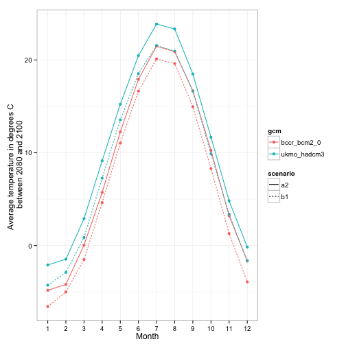
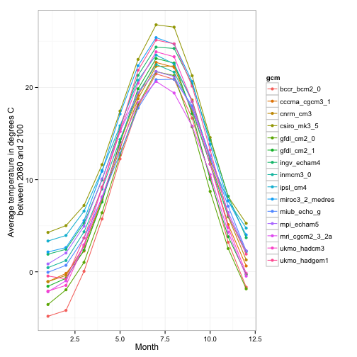

`rWBclimate` Introduction 
========================================================
rWBclimate is an R interface for the World Bank climate data used in the World Bank [climate knowledge portal](http://sdwebx.worldbank.org/climateportal/index.cfm).  

Installation
------
Right now the package is only installable from github with [devtools](http://cran.r-project.org/web/packages/devtools/index.html):

```R
install.packages("devtools")
require(devtools)

install_github("rWBclimate", "ropensci")
require(rWBclimate)
```
Package description
----

`rWBclimate` provides access to three different classes of climate data at two different spatial scales.  The three different classes of data are GCM model , ensemble and historical data.  Each data class will let you download two different four different types for two different variables.  The two variables are either precipitation expressed in millimeters or temperature as degrees celcius, and for each variable you can download your data in one of four types. The data is fully described below along with examples.

Data classes
---
*__Model data__*

Almost all model data in the Climate Data API are derived from 15 global circulation models (GCMs) used by the Intergovernmental Panel on Climate Change (IPCC) 4th Assessment Reports. The models simulate the response of the global climate system to increasing greenhouse gas concentrations. The data in the Climate Data API have been aggregated to both the country and basin levels, as explained below. Note these data are modeled estimates of temperature and precipitation changes in different time periods under different GCMs and scenarios. They include changes for future time periods and also as “backcasting” (model representations of the past) set for past time periods. The latter should not be confused with any instrumental or observed data. There is a specific dataset with historical measured climate data as well.

**Data types**

|Type|Description|
|----|----|
|Monthly average|The monthly average for all 12 months for a given time period|
|Annual average|a single average for a given time period|
|Monthly anomaly|Average monthly change (anomaly).  The control period is 1961-1999 for temperature and precipitation variables, and 1961-2000 for derived statistics.|
|Annual anomaly|Average annual change (anomaly). The control period is 1961-1999 for temperature and precipitation variables, and 1961-2000 for derived statistics.|

**Data time scales**

Climate model data is only available as averages for 20 year chunks.  The package will automatically convert any start and end data into valid API calls and will return all data between the given start and end date.  The following time periods are available


|Past|     |Future|    |
|----|-----|------|----|
|*start*|  *end*  |  *start*  |*end*|
|1920  | 1939|  2020 | 2039 |
|1940 |  1959|  2040 |2059|
|1960 |   1979|  2060 |2079 |
|1980  | 1999| 2080 | 2099 |

**Data spatial scales**
Data is available at two spatial scales.  The first is country level. You can download data for any country in the world using a valid [ISO 3 letter country code](http://userpage.chemie.fu-berlin.de/diverse/doc/ISO_3166.html). Alternatively you can download data at the basin network for a slightly higher resolution represented as a number 1-468.  This is based on level 2 boundaries from [waterbase.org](http://www.waterbase.org), or you can view a [full map of all the available basins.](http://data.worldbank.org/sites/default/files/climate_data_api_basins.pdf)


**_Downloading GCM Model Data_**

Model data is downloaded for two different scenarios, the [A2 and B1](http://en.wikipedia.org/wiki/Special_Report_on_Emissions_Scenarios). Generally A2 scenarios are where there is little difference between the future and now and B1 is a more ecologically friendly world with greater decrease in emissions. Both the A2 and the B1 will be downloaded for 15 different GCM models listed in the table below:


|Name in output|Model name|
|--------------|----------|
|bccr_bcm2_0 |[BCM 2.0](http://www-pcmdi.llnl.gov/ipcc/model_documentation/BCCR_BCM2.0.htm)|
|csiro_mk3_5|[CSIRO Mark 3.5](http://www.cawcr.gov.au/publications/technicalreports/CTR_021.pdf)|
|ingv_echam4|[ECHAM 4.6](http://www.bo.ingv.it/)|
|cccma_cgcm3_1|[CGCM 3.1 (T47)](http://www.ec.gc.ca/ccmac-cccma/default.asp?lang=En)|
|cnrm_cm3|[CNRM CM3](http://www.cnrm.meteo.fr/scenario2004/indexenglish.html)|
|gfdl_cm2_0|[GFDL CM2.0](http://data1.gfdl.noaa.gov/nomads/forms/deccen/CM2.X)|
|gfdl_cm2_1|[GFDL CM2.1](http://data1.gfdl.noaa.gov/nomads/forms/deccen/CM2.X)|
|ipsl_cm4|[IPSL-CM4](http://mc2.ipsl.jussieu.fr/simules.html)|
|microc3_2_medres|[MIROC 3.2 (medres)](https://esg.llnl.gov:8443/metadata/browseCatalog.do?uri=http://esgcet.llnl.gov/metadata/pcmdi/ipcc/thredds/miroc3_2_medres.sresb1/pcmdi.ipcc4.miroc3_2_medres.sresb1.thredds)|
|miub_echo_g|[ECHO-G](http://www-pcmdi.llnl.gov/projects/modeldoc/cmip/echo-g_tbls.html)|
|mpi_echam5|[ECHAM5/MPI-OM](http://www.mpimet.mpg.de/en/science/models/echam.html)|
|mri_cgcm2_3_2a|[MRI-CGCM2.3.2](http://www.mri-jma.go.jp/Welcome.html)|
|inmcm3_0|[INMCM3.0](http://www.ipcc-data.org/ar4/model-INM-CM3.html)|
|ukmo_hadcm3|[UKMO HadCM3](http://www.metoffice.gov.uk/research/modelling-systems/unified-model/climate-models/hadcm3)|
|ukmo_hadgem1|[UKMO HadGEM1](http://www.metoffice.gov.uk/research/modelling-systems/unified-model/climate-models/hadgem1)|

The model data can be downloaded with two main functions:
```R
get_model_temp()  ## Get model temperature data
get_model_precip() ## Get model precipitation data
```
*Example 1: Plotting monthly data from different GCM's* 
Say you want to compare temperature from two different models in the USA to see how they vary.  You can download data for the USA and then subset it to the specific models you're interested in and then plot them.


```r
usa.dat <- get_model_temp("USA", "mavg", 2080, 2100)
usa.dat.bcc <- usa.dat[usa.dat$gcm == "bccr_bcm2_0", ]
usa.dat.had <- usa.dat[usa.dat$gcm == "ukmo_hadcm3", ]
## Add a unique ID to each for easier plotting
usa.dat.bcc$ID <- paste(usa.dat.bcc$scenario, usa.dat.bcc$gcm, sep = "-")
usa.dat.had$ID <- paste(usa.dat.had$scenario, usa.dat.had$gcm, sep = "-")
plot.df <- rbind(usa.dat.bcc, usa.dat.had)
ggplot(plot.df, aes(x = as.factor(month), y = data, group = ID, colour = gcm, 
    linetype = scenario)) + geom_point() + geom_path() + ylab("Average temperature in degrees C \n between 2080 and 2100") + 
    xlab("Month") + theme_bw()
```

 


Subsetting all the data can be a bit tedious.  You could also compare all the models but just for one scenario, the A2


```r
ggplot(usa.dat[usa.dat$scenario == "a2", ], aes(x = month, y = data, 
    group = gcm, colour = gcm)) + geom_point() + geom_path() + ylab("Average temperature in degrees C \n between 2080 and 2100") + 
    xlab("Month") + theme_bw()
```

 


